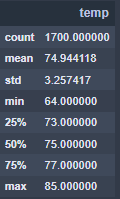
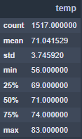
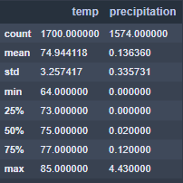
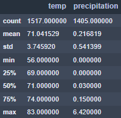

# surfs_up

## Project Overview

W. Avy, an investor interested in partnering in your Surf'n'Shake shop in Hawaii, wants additional weather analysis conducted. The additional analysis will consist of:

- Temperature analysis for the month of June 
- Temperature analysis for the month of December

The purpose of this analysis is to provide insights and recommendations to W. Avy so that he can make an informed decision whether or not to invest in the business.

## Results

Below are the descriptive temperature statistics for both June and December on the island of Oahu, Hawaii.

June temperature 

December temperature

- There were 1700 temperature readings for the month of June while December had 1517, which is a reduction of 10.76%. Despite the lower number of readings in December there are still of sufficient amount for the subsequent statistics to be considered valid. 
- There is only a 2°F difference between the max temperature for June (85°F) and the max temperature for December (83°F).
- There is an 8°F difference between the minimum temperature for June (64°F) and the minimum temperature for December (56°F).
- There is a 4°F difference between the average temperature for June (75°F) and the average temperature for December (71°).

## Summary

Based on the analysis of temperature Oahu, Hawaii would appear to be an ideal location for a Surf'n'Shake shop as there is little season variation. The weather is uniformly warm throughout the year. However, business will potentially be impacted by more then just temperature.  A similar analysis on precipitation needs to be considered as well. 

June temperature and precipitation

December temperature and precipitation

The average precipitation for June is 0.14 inches while for December it is 0.22 inches. This indicates that these is also little seasonal variation in precipitation and that the overall precipitation is relatively low. Additionally the first quartile and median precipitation for June are 0.00 inches and 0.02 inches respectively. The first quartile and median precipitation for December is 0.00 inches and 0.03 inches. This indicates that for half of the days in the months analyzed there was either none, or exceptionally little precipitation. This confirms that Oahu, Hawaii will be an ideal location for the Surf'n'Shake location.  
